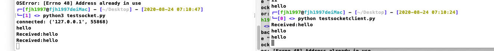

# Pysockcs-simple

In netcat I can send data while receive data at the same time.And for python programming if you use recv() and send() in only one thread,you cannot send data until recv() is finished cause recv() block the thread.

Now I make a simplest python socket implemention to behave like netcat with send and recv socket data at the same time (Just to make send and recv in seperate thread)

